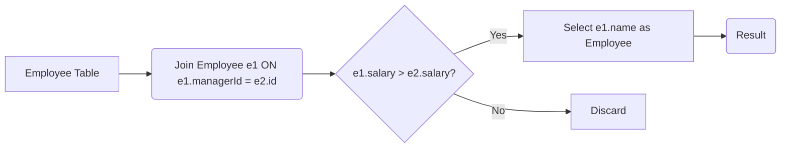

# 00181 - Employees Earning More Than Their Managers
    
**Language:** Mysql  
**Runtime:** 356 ms (Beats 92.69% of users)  
**Memory:** 0B (Beats 100.00% of users)  

## 💡 **Problem Explanation**

The problem requires identifying employees who earn more than their managers.  Given an `Employee` table with employee information (id, name, salary, and managerId), the task is to output the names of employees who have a higher salary than their managers.

**Example:**

**Employee Table:**

| id  | name  | salary | managerId |
|-----|-------|--------|-----------|
| 1   | John  | 80000  | 5         |
| 2   | Jane  | 90000  | 5         |
| 3   | Tom   | 60000  | null      |
| 4   | Chris | 70000  | 3         |
| 5   | Mark  | 100000 | null      |

**Expected Output:**

| Employee |
|----------|
| John     |
| Jane     |

**Explanation:**

- John (salary 80000) reports to Mark (salary 100000). John does not earn more than his manager.
- Jane (salary 90000) reports to Mark (salary 100000). Jane does not earn more than her manager.
- Chris (salary 70000) reports to Tom (salary 60000). Chris earns more than his manager.

## 📊 **Algorithm**

Here's the algorithm for both methods:

**Method 1 (JOIN):**

*   Join the `Employee` table with itself using the `managerId` to link employees to their managers.
*   Filter the results to include only those employees whose salary is greater than their manager's salary.
*   Select the names of these employees.

**Method 2 (Subquery):**

*   For each employee, find their manager's salary using a subquery.
*   Compare the employee's salary with their manager's salary.
*   Return the names of employees whose salary is greater than their manager's salary.

## 🔥 **Code Implementation**

```mysql
# METHDOD 1
select e1.name as Employee from employee e1
join employee e2 on e1.managerId = e2.id
where e1.salary>e2.salary;

#METHOD 2
-- select E.name as Employee from Employee as E
-- where E.managerId is not null
-- and E.Salary > (
--     Select Salary from Employee E2
--     where E2.id = E.managerID
-- )
```

## 📊 **ASCII Representation**

```
Employee Table:

+-------------+---------+
| Column Name | Type    |
+-------------+---------+
| id          | int     |
| name        | varchar |
| salary      | int     |
| managerId   | int     |
+-------------+---------+
```

## 📊 **WORKING**

Let's trace Method 1 using the example data:

**Employee Table:**

| id  | name  | salary | managerId |
|-----|-------|--------|-----------|
| 1   | John  | 80000  | 5         |
| 2   | Jane  | 90000  | 5         |
| 3   | Tom   | 60000  | null      |
| 4   | Chris | 70000  | 3         |
| 5   | Mark  | 100000 | null      |

1.  **Join Operation:** The `Employee` table is joined with itself (aliased as `e1` and `e2`) where `e1.managerId = e2.id`.

    Resulting joined table (conceptual):

    | e1.id | e1.name | e1.salary | e1.managerId | e2.id | e2.name | e2.salary | e2.managerId |
    |-------|---------|-----------|--------------|-------|---------|-----------|--------------|
    | 1     | John    | 80000     | 5            | 5     | Mark    | 100000    | null         |
    | 2     | Jane    | 90000     | 5            | 5     | Mark    | 100000    | null         |
    | 4     | Chris   | 70000     | 3            | 3     | Tom     | 60000     | null         |

2.  **Filtering:** The `WHERE` clause filters the joined table: `e1.salary > e2.salary`.

    *   John's salary (80000) > Mark's salary (100000) is false.
    *   Jane's salary (90000) > Mark's salary (100000) is false.
    *   Chris's salary (70000) > Tom's salary (60000) is true.

    Filtered table:

    | e1.id | e1.name | e1.salary | e1.managerId | e2.id | e2.name | e2.salary | e2.managerId |
    |-------|---------|-----------|--------------|-------|---------|-----------|--------------|
    | 4     | Chris   | 70000     | 3            | 3     | Tom     | 60000     | null         |

3.  **Selection:** The `SELECT` clause selects `e1.name` (the employee's name).

    Result:

    | Employee |
    |----------|
    | Chris    |

**Flow Diagram:**



## 🚀 **Time & Space Complexity**

**Method 1 (JOIN):**

*   **Time Complexity:**  The time complexity is **O(n^2)** in the worst case, where n is the number of employees. This is due to the join operation potentially requiring a comparison of each employee with every other employee. However, with proper indexing, the performance can be significantly improved.

*   **Space Complexity:** The space complexity is **O(n)** in the worst case, as the joined table can grow linearly with the number of employees.

**Method 2 (Subquery):**

*   **Time Complexity:** The time complexity is also approximately **O(n^2)** in the worst case. For each employee, the subquery is executed to fetch the manager's salary.

*   **Space Complexity:**  The space complexity is **O(1)** (or constant) as we're only storing scalar values during the comparison.

In practice, the JOIN method often performs better due to database optimizations for join operations.
    